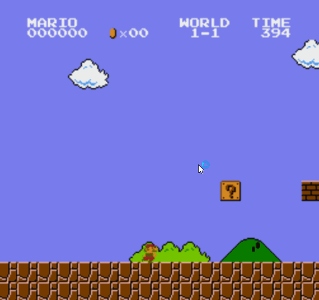
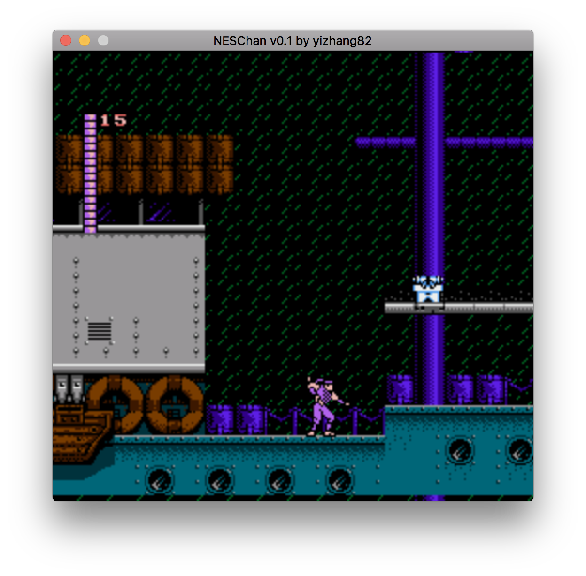

# NESChan - a cross-platform NES emulator for Windows/Mac  

## What is it

NesChan is a NES emulator I wrote just for fun. The idea of writing yet another NES emulator is inspired from a [medium post](https://medium.com/@fogleman/i-made-an-nes-emulator-here-s-what-i-learned-about-the-original-nintendo-2e078c9b28fe) I read recently. After reading nesdev wiki for a while I decided to give it a try mid-December 2017. It took me around week and half to get quite a few major titles perfectly (SMB, Super Contra, Shadow of the Ninja, etc). But it's still in its early stages and I'll update this when something changes.

See *Super Mario Bros* and *Super Contra* in action:

NesChan supports both Windows and Mac:

## What is the goal

Just for fun - it's fun learning about NES hardware, how the games work, and getting my favorite game working. It is almost as exciting as writing my own game - except I don't have to write any games. There is something magical about seeing the little pixel sprites moving around in screens.

I don't plan to create the greatest emulator ever. As far as I can see [Mesen](https://www.mesen.ca/) is as good as it gets. 

## Which platform is supported 

Currently Windows and Mac. I've only tested on Windows 10 and mac OSX High Sierra but there is a good chance it should work in earlier versions. I haven't got around to try out linux yet but it should be relatively straight-forward given NesChan doesn't use any platform specific API nor libraries.

## What NES functionality is supported

* CPU - all official and most unofficial instructions, with accurate cycle emulation (but it can't stop mid-instruction). 
* PPU - rendering pipeline with goal of cycle accuracy. It's not exactly right yet but pretty close. 
* Mappers - 0, 1 (partial), and 4 (partial - no scanline counting / IRQ support)
* Controllers - NES standard controller emulation only. Supports keyboard and game controllers. I've tested with my XBOX One controller. 
* APU - NYI. This is on top of my list.

## What game does it run

It's still in its early stage and only supports a few mappers (0, 1, a part of 3) so it only supports a small set of games. 

I've tested with following games:

* Mapper 0
  * Donkey Kong - no problems
  * Balloon Fight - no problems
  * PopEye - no problems
  * Ice Climber - no problems
  * Super Mario Bros - no problems
* Mapper 1
  * Dr Mario - no problems
  * Mega Man 2 - vertical transition is somewhat glitchy. Otherwise plays just fine
  * Ninja Gaiden - no problems
  * Metroid - freeze on start
* Mapper 4
  * Shadow of the Ninja - no problems
  * Super Contra - first level boss fight background disappear. Otherwise works fine.
  * Super Mario Bros 2 - mario's eye is missing. Otherwise works.
  * Teenager Mutant Turtle 2 - freeze on start
  * Teenager Mutant Turtle 3 - freeze on start

## How to build

### Building on Windows

You'll need VS 2017 and SDL2. Support for clang on mac/linux isn't available yet but should be straight-forward.

* Clone the repo
* Download SDL development libraries [SDL2-devel-2.0.7-VC.zip](https://www.libsdl.org/download-2.0.php) and unzip it into dep/sdl2
* Open *neschan.sln* in VS 2017 and build x64 Debug/Release

Neschan.sln has 3 projects:

* *Neschan* - the main app that implements main game/rendering loop and controller support. Currently uses SDL.
* *Neschanlib* - static library that emulate NES hardware. Other clients written in other languages can simply link to this library statically or dynamically (NYI). 
* *Test* - using doctest with a combination of simple inline assembly and test roms (mostly from [NesDev Emulator Tests](http://wiki.nesdev.com/w/index.php/Emulator_tests))

### Building on Mac

You'll need SDL2, XCode developer build tools, CMake. 

* Clone the repo
* Download SDL development libraries for Mac [SDL2-2.0.7.dmg](https://www.libsdl.org/download-2.0.php) and unzip it into dep/sdl2
* Under neschan repo, create a bin directory 
* cd bin
* cmake -DCMAKE_BUILD_TYPE=release ..
* make

## How to run

neschan.exe *rom_path* 

Sorry. No fancy UI yet. 

## Next steps

In the order of "most likely" to "probably never going to happen"... :)

* APU support - this one isn't too bad but I need to wrap my head around triangle waves, envelops, sweeps, delta modulations first...

* More mappers and more game support - Ninja Gaiden 2/3 and TMNT 2/3 are on top of my list (which I suspect are due to missing IRQ support in mapper 4).

* Add more test ROMs - it's way more effective to debug test ROMs than actual games! Not to mention they are good regression tests.

* Save/Load states - enough said. Being able to go backward instantly would be even more awesome. 

* Port to other languages - just for learning about other languages.

* Add proper UI - so far I've mostly stayed away from it and keep it just rendering (like a real game). But I've no intention to draw my own UI like a real game in SDL. I'm not yet sure which UI library I'm going to use yet - but it's probably not going to be MFC in 2017, and it should be cross-platform. Couple of ideas:
  * Electron.js - Write a UI in JS as well as a JS library to interop with C/C++ neschanlib (using [N-API](https://nodejs.org/api/n-api.html)). Not sure about 2D rendering and controller support, though. 
  * WinForms - Should work great on Windows + .NET desktop. Mono supports it too. Too bad .NET Core doesn't. It's pretty compelling - the only reason I don't want to go this route because I'm already pretty familiar with C#/.NET/WinForm.
  * Qt - I haven't played with QT much. 

* A built-in debugger - I realized this is basically a necesscity after debugging game / test ROMs. I frequently use [Mesen](https://github.com/SourMesen/Mesen)'s fantastic debugger to debug games to understand their behavior, viewing PPU memory/tiles/sprites and compare differences. It's extremely valuable to be able to see that glitching tile is index 0x80 and in address 0x1010. Having one built-in would greatly speed up development. 

* A development environment. Imagine a NES Studio built on top of Eclipse / VSCode / VS - making translation/hacking ROMs/writing your own ROMs much easier.

## If you are interested in more details

*TODO* - I'll write a series of blog post on my experience in developing a NES emulator in 2017. 

## References

* [NES Documentation by Patric Diskin](http://nesdev.com/NESDoc.pdf)
* [NESDev wiki](http://wiki.nesdev.com/w/index.php/Nesdev_Wiki)
* [6502 CPU](http://wiki.nesdev.com/w/index.php/CPU)
  * [6502 CPU Instruction Set](http://obelisk.me.uk/6502/reference.html)
* [PPU](http://wiki.nesdev.com/w/index.php/PPU)
  * [PPU Registers](http://wiki.nesdev.com/w/index.php/PPU_registers)
  * [PPU Rendering](http://wiki.nesdev.com/w/index.php/PPU_rendering)
  * [PPU Scrolling](http://wiki.nesdev.com/w/index.php/PPU_scrolling)
* [Standard Controller](http://wiki.nesdev.com/w/index.php/Standard_controller)
* [Mappers](http://wiki.nesdev.com/w/index.php/Mapper)